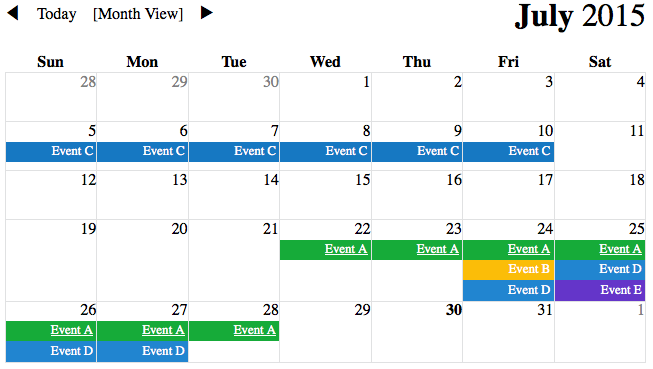

# tannen.js
Responsive React.js event calendar



## Dependencies
[React.js](https://github.com/facebook/react)
[moment](https://github.com/moment/moment/)

are both considered external dependencies, so they are not packed/distributed within this component set, but must be included in your setup.

## Installation
- `npm install tannen.js`
- open `example/index.html` in a browser

If you clone the project from Github, make sure you run `npm install` to get all the dependencies.

## Usage
```
var React = require('react');
var Tannen = require('tannen.js');

React.render(
  <Tannen
    init_date='2015-07-01'
    events={[
      {
        start_date: '2015-07-22',
        end_date: '2015-07-28',
        title: 'Bully George McFly'
      },
      {
        start_date: '2015-07-24',
        end_date: '2015-07-24',
        title: 'Hang out at Cafe 80\'s'
      },
      {
        start_date: '2015-07-05',
        end_date: '2015-07-10',
        title: 'Recover almanac'
      },
      {
        start_date: '2015-07-24',
        end_date: '2015-07-27',
        title: 'Borrow DeLorean'
      },
      {
        start_date: '2015-07-25',
        end_date: '2015-07-25',
        title: 'Bully Marty McFly'
      }
    ]}/>,
  document.getElementById('tannen-example')
);
```